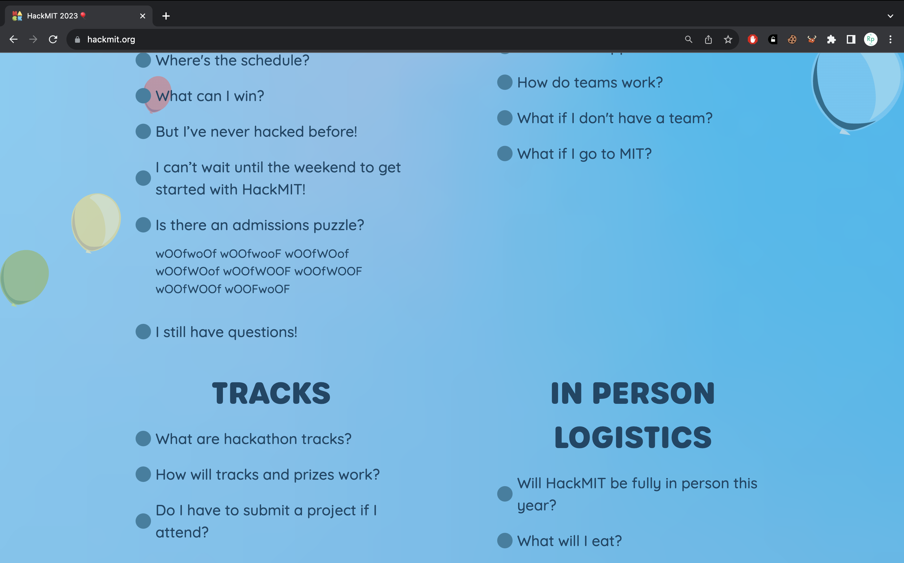
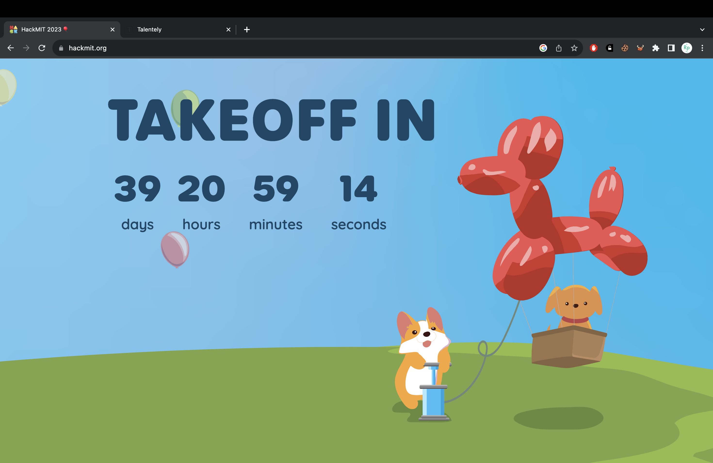
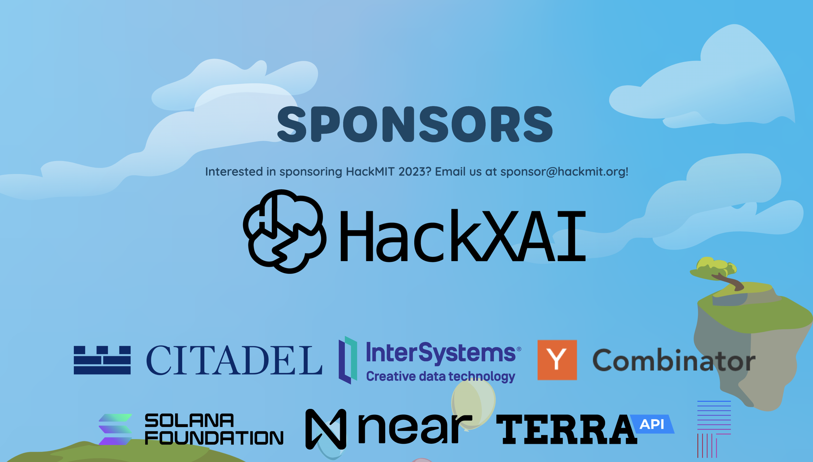
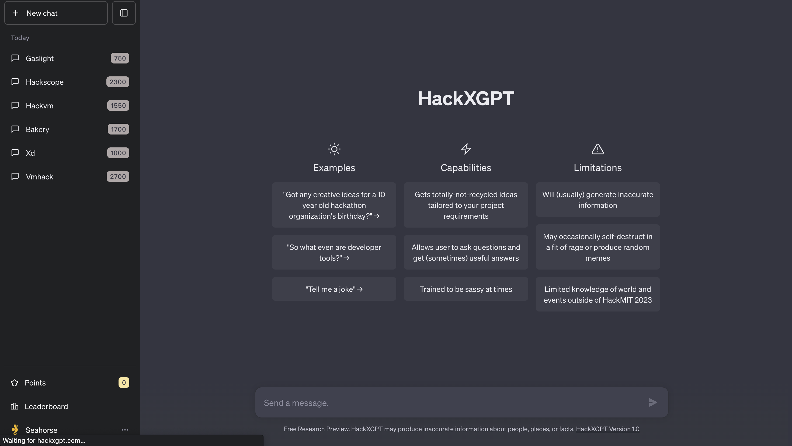
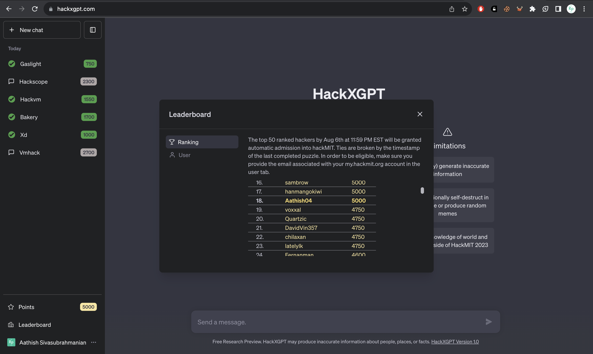

# HackXGPT - HackMIT Puzzle CTF 2023

tl;dr: I participated in the HackMIT 2023 Entry Puzzle CTF, where the top 50 participants are guaranteed entry to HackMIT, and managed to solve 4 of 6 challenges. By the end of the puzzle period, I was ranked 18th on the leaderboard internationally!

## The Background

Every year, MIT organises their flagship Hackathon HackMIT, for which there's usually an entry puzzle, where participants who solve portions of the puzzle are guaranteed entry to HackMIT. This year, they implemented a leaderboard system, where the top 50 participants by the end of the Puzzle period are guaranteed entry to the hackathon.

This is the first time I'm participating in the entry Puzzle CTF and I expect it will be a lot of fun!

## Finding the CTF Command Centre

Visiting the [HackMIT Website](https://hackmit.org/), the answer to the "Is there an admissions puzzle?" question is quite strange:

The alternating upper and lowecase letters are vaguely reminiscent of Binary. Let's see what the wierd string is in binary:

"wOOfwoOf wOOfwooF wOOfWOof wOOfWOof wOOfWOOF wOOfWOOF wOOfWOOf wOOFwoOF" -> "01100010 01100001 01101100 01101100 01101111 01101111 01101110 01110011"

Let's interpret this as ASCII, and see what it says:

"01100010 01100001 01101100 01101100 01101111 01101111 01101110 01110011" -> "balloons"

So the entry has something to do with "balloons", and all this woofspeak means its probably something to do with a dog as well.

Looking at the page, we find at the very bottom, an adorable dog inside a hot air balloon!

We click on the dog several times, and the balloon floats away, but a new link [`HackXAI`](https://hackxgpt.com/) appears in the Sponsors Section. We click it, and we're sent to the Command Centre for the CTF.

## Enabling the Challenges

We log in with our Github ID, and we're presented with a webpage reminiscent of ChatGPT.

We start a new conversation, entirely in woofspeak. It gives us some great backstory! I wrote [a script](./DogToEng.py) to convert WoofSpeak to english, and you can see the whole story there.

At the end, we're asked for a passcode, and we enter `balloons`, the secret word we decoded from the main page, and then we're dropped into the actual Command Centre with access to all the CTF challenges!

## Result and Outcomes
Out of the 6 challenges available, I managed to solve four of them - Bakery, Gaslight, Hackvm and Xd - giving me a total of 5000 points, and putting me on the leaderboard at rank 18 internationally at the end of the puzzle period.

I promptly got an [email](./AdmittedEmail.pdf) soon after the puzzle period closed, and [my profile page](./HackMIT2023AdmittedPage.pdf) on the HackMIT website reflected my new status as "Admitted".

All in all, this CTF was a lot of fun, and I'll definitely be trying out the puzzle next year as well! 