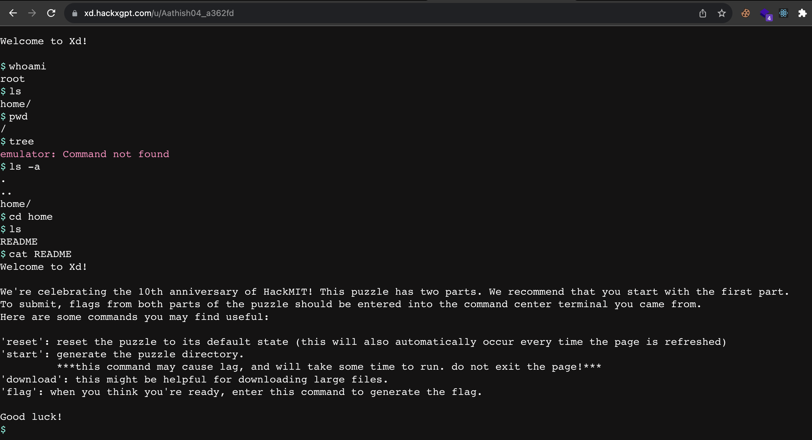
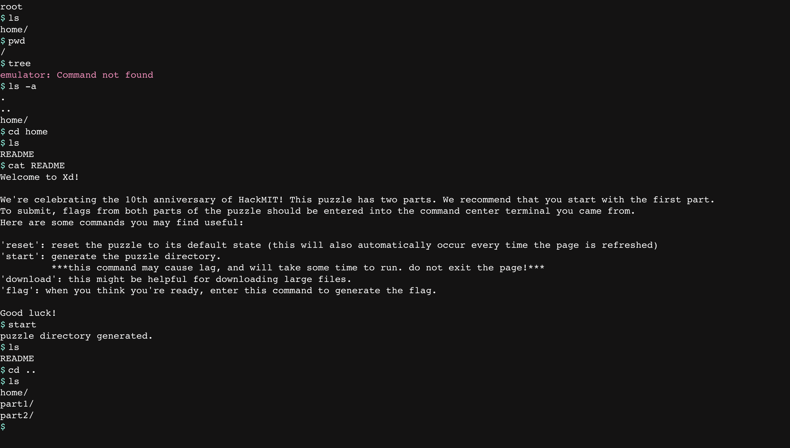
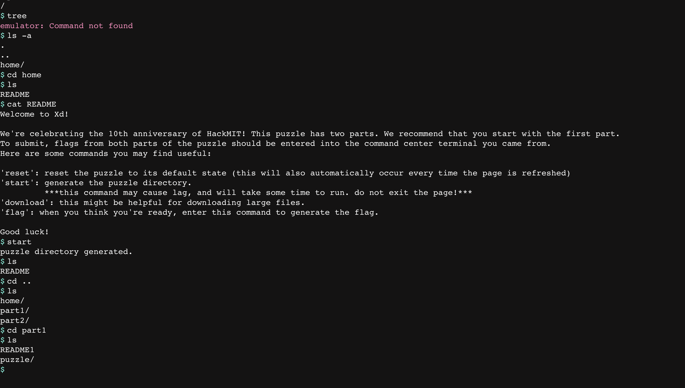
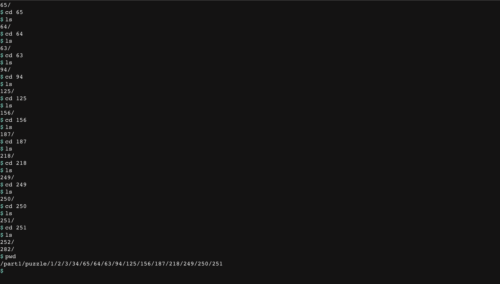
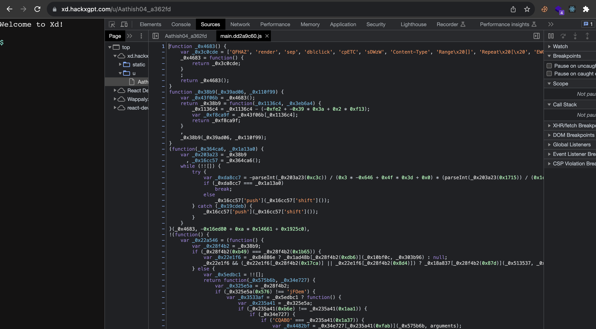
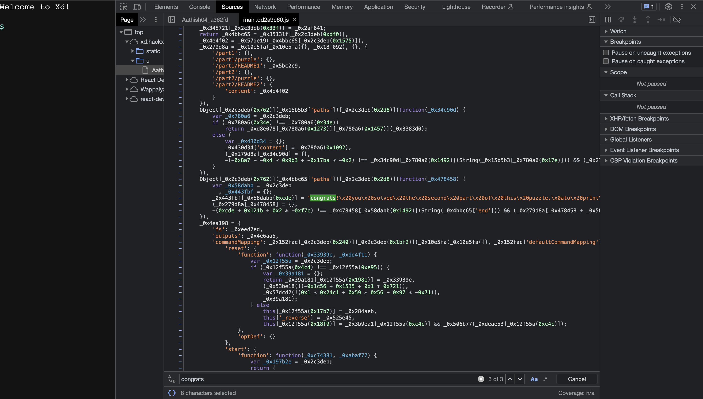
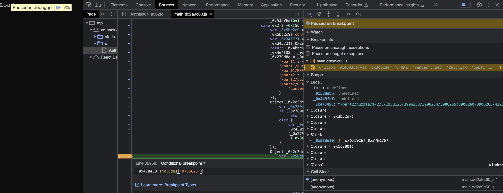

# Xd

Disclaimer: My method of solving this challenge is most probably not the intended method of solving the challenge.

tl:dr: I bruteforced my way through the directories to solve the first part of the challenge, and for the second part, I reverse engineered just enough of the obfuscated Javascript to identify the path that had to be traversed as it was generated.

## The Briefing

> We hope you don't have too much trouble trying to capture [this flag…](https://xd.hackxgpt.com/u/Aathish04_a362fd)

## Stage 1 : Reconnaissance

It seems like we've been dropped into a WebShell where we can execute a limited set of commands. None of the fancier ones like `find` or `grep` seem to work.

Travelling to the `/home` directory, we find a file called `README` and we do just that.



So let's run the `start` command and wait patiently:

After a significant delay, we get the message `Puzzle Directory Generated.`



As the puzzle creators recommended, let's try solving part 1 first.

We move into the `/part1` directory, and immediately we notice that `ls` takes a much, much longer time to run than usual. This will be significant later.



On printing the `README1` file, we get a long list of numbers.


Interesting. We use the `download` command to save this file [here](./README1.txt) and then `cd` into the `/puzzle` directory and list its contents.


We see a directory named `1/`. Let's traverse the directory structure as much as we can:

When we reach the directory named `251`, we find that we have two options before us:



It seems like we should make the decision of which path to take, based on the paths we've previously traversed. Since the path names match the numbers in the `README1` file, we have to find the pattern in the paths with the help of the file and `cd` to the last one.

## Stage 2 : Solving Part 1

Reader, I'll be honest - I really, genuinely tried to figure out what the pattern was. I just couldn't decipher the pattern in the end, so I decided to bruteforce my way through all possible directories by writing a [Selenium](https://www.selenium.dev/) [ script in a Jupyter Notebook](./Traverse.ipynb).

After around 25 minutes, we find that the path where the flag is located turns out to be:

```
/part1/puzzle/1/2/3/34/65/64/63/94/125/156/187/218/249/250/251/282/313/314/315/346/377/376/375/406/437/468/499/530/561/560/559/590/621/622/623/654/685/686/687/718/749/780/811/812/813/782/751/720/689/690/691/722/753/754/755/786/817/818/819/788/757/726/695/696/697/698/699/668/637/638/639/640/641/672/703/702/701/732/763/762/761/792/823/824/825/826/827/828/829/860/891/922/953/954/955/924/893/894/895/926/957/958/959/960/961
```

In the final directory, we see a file named `flag` with some instructions:


And we find the first part of the flag printed in the console!

## Stage 3 : Solving Part 2

Armed with the full path to Part 1, I tried figuring out the pattern, and even wrote a couple of Jupyter notebooks to help me [Analyse](./Analyse.ipynb) the path from Part 1 and [Generate](./Generate.ipynb) the path for Part 2. Sadly, I still couldn't determine the pattern.

Now, it took approximately 25 minutes to bruteforce our way through the directories for Part 1. The README for Part 1 only lists around 511 directories. On the other hand, the README for Part 2 lists 118100 directories. Assuming it takes two seconds to visit a directory and figure out if it contains the flag, bruteforcing through the entirety of Part 2 will take around 2.733 days. Hoping it would take a little lesser than that, I tried bruteforcing Part 2 as well.

After about 150 minutes, I notice that my bruteforcer was using way too much RAM.

We need another approach.

Looking at the network requests made when Xd runs, we find that it's entirely client-side, which means that the whole directory structure is probably generated using client-side Javascript.

Let's try analysing the JavaScript to see if anything stands out, or if we can somehow reduce the delay that `ls` causes.


The Javascript is _severely_ obfuscated, but let's do our best.

First, we ask Chrome Devtools to beautify the code:



Now, we might not have clear variable names, but at least the control flow is somewhat understandable from the indentation.

### Approach 1 : Trying to reduce the amount of time `ls` takes:

Let's try to see if the delay that's caused when typing `ls` can be reduced somehow.

Searching for the string `ls` we find 3848 different candidates, and a lot of these are substrings of other strings.

Searching just for `'ls'` yields two possible options, and in both cases, the string is inside an array with an obfuscated name, but next to which the string `commandNames` appears. Perhaps this is where the list of accepted commands is declared?


We keep searching for various versions of the word `ls` and come across two very interesting instances:

We find two occurrences of what seems to be the path `./src/commands/ls.js`, which gets mapped to a function. Perhaps this is where `ls`'s behaviour is defined?

I set breakpoints at both those functions, and discovered that no matter when `ls` is run, (before or after `start` is run), only one of the functions gets executed. I stepped through the function, and set various breakpoints at various places, but could never determine exactly when the delay was introduced.

### Approach 2 : Trying to find the flag's path as it gets generated.

We know that the directories are generated client-side, so we should be able to determine where exactly the flag will be, _as_ the paths are generated.

From the previous puzzle, we know that the directory in which the `flag` command works has a file called `flag` with instructions on how to generate and use the flag. Searching for some of the same words that occurred in Part 1's file, like `congrats`, we find a very peculiar function next to a string that vaguely reads `congrats! you solved the second part...`:



Let's set a breakpoint here, and see how values change once we reload the page. Maybe the string will get inserted into the appropriate folder, and we can figure out the path from there?


Stepping through the execution, we find that this variable `_0x478458` seems to store the current path being generated (I have no idea if this is true or not - it just seems that way).

Now, I tried setting a conditional breakpoint - so the debugger only stops when a particular condition on a variable is met.

First, I tried setting the conditon to be such that the string in the variable `_0x478458` should contain the word `flag`, since the `flag` file would be in the directory structure, but that didn't seem to work. The debugger didn't stop at all.

Perhaps `_0x478458` only stores the _directories_ as they're generated?

From Puzzle 1, we know that the flag will be in the directory named after the very last number that appears in the README file for the Puzzle, and skipping to the very end of [`README2.txt`](./README2.txt), we find that the last directory should be named `9765625`. Setting the conditional breakpoint to stop only when `_0x478458` contains the string `9765625`, we finally get the path we need, which turns out to be huge: 

```sh
/part2/puzzle/1/2/3/1953128/3906253/3906254/3906255/3906260/3906265/4296890/4687515/5078140/5468765/5468770/5468775/5468800/5468825/5468824/5468823/5546948/5625073/5703198/5781323/5781324/5781325/5703200/5625075/5625200/5625325/5703450/5781575/5781574/5781573/5703448/5625323/5547198/5469073/5484698/5500323/5515948/5531573/5531574/5531575/5515950/5500325/5500350/5500375/5501000/5501625/5517250/5532875/5532874/5532873/5517248/5501623/5485998/5470373/5473498/5476623/5492248/5507873/5508498/5509123/5524748/5540373/5540374/5540375/5524750/5509125/5509100/5509075/5524700/5540325/5540324/5540323/5524698/5509073/5493448/5477823/5555948/5634073/5712198/5790323/5790324/5790325/5712200/5634075/5633950/5633825/5649450/5665075/5680700/5696325/5696450/5696575/5696700/5696825/5699950/5703075/5702950/5702825/5702700/5702575/5686950/5671325/5655700/5640075/5640200/5640325/5718450/5796575/5796574/5796573/5718448/5640323/5562198/5484073/5499698/5515323/5530948/5546573/5546574/5546575/5530950/5515325/5515350/5515375/5531000/5546625/5546624/5546623/5530998/5515373/5515498/5515623/5593748/5671873/5671874/5671875/7625000/9578125/9593750/9609375/9687500/9765625
```



We remove the breakpoint, and let the rest of the directories generate.

Now, let's `cd` to the directory we just found and see if we were right!


And yes! This was the right directory!

We concatenate the portions of the flag that we got from solving Part 1 and Part 2, and submit it to the Command Centre, and we've successfully completed the `Xd` challenge!